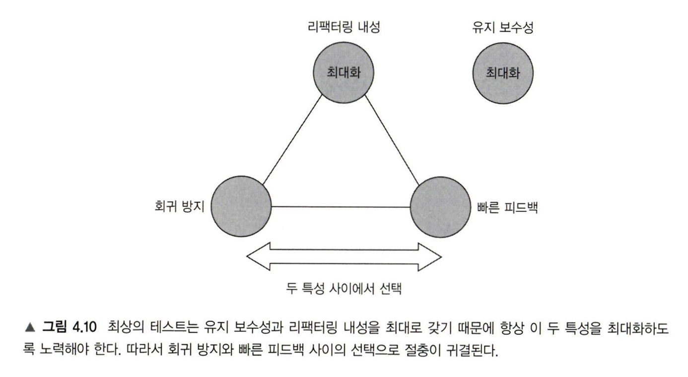

## 1장 단위 테스트의 목표

- 프로젝트가 발전함에 따라 코드의 엔트로피가 증가하며 나빠지는 경향이 있다. 테스트를 통해 안전망 역할, 회귀에 대한 보험을 제공할 수 있다.
- 가치 있는 테스트만 남기고 나머지는 모두 제거하라. 애플리케이션과 테스트 코드는 모두 자산이 아니라 부채다.
- 테스트 코드와 커버리지가 좋지 않다면 애플리케이션 코드 품질이 좋을 수 없다. 하지만 그것들이 좋다고해서 애플리케이션 코드 품질이 좋은 것은 아니다.
- 시스템의 핵심 부분에 커버리지가 높으면 좋지만, 그것이 기준이 되면 안된다.

## **2장 단위 테스트란 무엇인가**

- 단위 테스트의 정의는 다음과 같다.
    - 단일 동작 단위를 검증
    - 빠르게 수행
    - 다른 테스트와 별도로 처리
- 런던파 vs. 고전파의 각각의 장단점들
- 런던파의 경우 처음에는 좋아 보이지만, 동작 단위를 검증하는 것이 아니라 코드 단위를 검증하기(= 세부 구현에 결합된 테스트) 때문에 이것이 오히려 좋지 않은 코드 설계를 숨기는 결과를 낳는다.

## **3장 단위 테스트 구조**

- 테스트 내 준비, 실행 또는 검증 구절이 여러 개 있다면 여러 동작을 한번에 검증한다는 표시임으로 나누어야 한다.
- 실행 구절이 한 줄 이상이면 SUT의 API에 문제가 있을 확률이 높다. 잠재적 모순을 방지하기 위해 코드를 캡슐화 하여 실행 구절을 1개로 만드는 것이 좋다.
- 기획자가 보고 이해할 수 있는 시나리오와 같은 테스트명을 지어라.
    - 동작을 검증하는 것 임으로 테스트명에 대상 메서드 이름을 넣는 것은 불필요 하다.

## **4장 좋은 단위 테스트의 4대 요소**

- 좋은 단위 테스트의 네 가지 기본 특성
    - 회귀 방지
    - 리펙터링 내성
    - 빠른 피드백
    - 유지 보수성
- 테스트의 가치는 네 가지 특성 각각 얻은 점수의 곱이다. 따라서 하나라도 0이면, 가치는 0이다.
- 블랙박스 테스트 방법으로 테스트를 작성하고, 화이트박스 방법으로 테스트를 분석하라.

## **5장 목과 테스트 취약성**

- 목은 외부로 나가는 상호 작용(ex. SMTP) , 스텁은 내부로 들어오는 상호작용(ex. DB)
- 스텁은 일반적으로 구현의 세부사항 임으로 상호 작용을 검증할 필요가 없다. 목은 그 반대.
- 잘 설계된 코드는 동작 == 공개 API, 구현 세부 사항 == 비공개 API를 만족시킨다. (캡슐화 잘해라)
- 시스템 내 통신을 검증할 때는 세부사항 임으로 목을 사용하지 말자. 시스템 간 통신이고 해당 통신이 부수적 효과가 외부 환경에서 보일 때만 목을 사용하는 것이 타당하다.